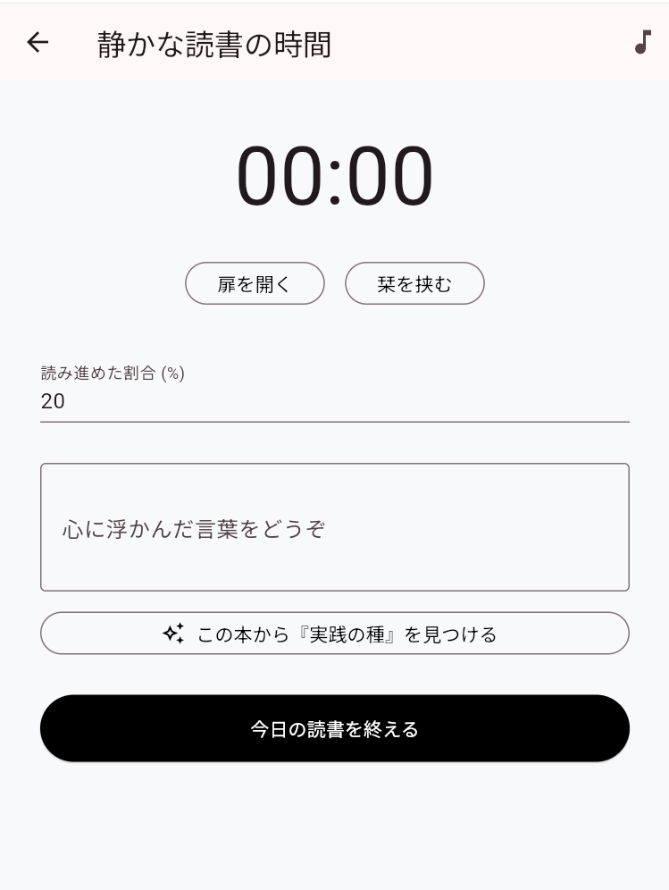

# 森宗伶太 | Reita Morimune

広島工業大学 情報コミュニケーション学科 3年  

「仲間と一緒に成果物を作り上げ，それを使ってもらい感謝されることを目標！」

---

## 🌐 Portfolio

🔗 ポートフォリオサイト  
https://nekomikandayo.github.io/portfolio/

---

## 🛠 Skills
- HTML / CSS / JavaScript / Node.js
- C（大学で2年間学習）
- 基本情報技術者試験 合格

---
## 📂 Output

### 📝 TIL (Today I Learned)
**日々の技術的な学びや気づきを記述**

- フロントエンド技術やクリーンコードに関する学習記録を、3か月以上継続してアウトプット
- 単なるメモではなく、「なぜその技術が必要か」という思考プロセスを重視
- チーム開発において必須となる「暗黙知をなくし、言語化して共有する力」の向上を目的として運用

#### 🔗 Links
- 💻 **Repository** https://github.com/nekomikandayo/TIL

---
### 👥 共有ToDoアプリ
**FuelPHP + Knockout.js を用いたチーム向けToDo管理アプリ**

- MVCアーキテクチャを意識し、Controller / Model / View を分離
- Docker を利用し、開発環境をコンテナ化
- Knockout.js + Fetch API を用いた非同期CRUDを実装
- グループ機能・招待URL・ログイン認証を実装
- CSRF対策やバリデーションを行い、セキュリティを考慮
- GitHub Flow を意識したブランチ運用・PRベース開発を実践

#### 🔗 Links
- 💻 **Source Code**  
  https://github.com/nekomikandayo/shared-todo-app

<h4>ToDo、group一覧画面</h4>

  
  

  
---

### 📘 Reading Habit（習慣化読書アプリ）
**忙しい中でも「短時間の読書 → 振り返り → 習慣化」を実現するWebアプリ**

- UI・画面遷移・データ構造を自分で設計
- Firebase と連携し、認証・データ保存を実装
- 読書時間の計測＋気づきの即時アウトプットで定着を支援

#### 🔗 Links
- 🌐 **Live Demo**  
  https://reading-habit-app.web.app
- 💻 **Source Code**  
  https://github.com/nekomikandayo/reading-habit-app

---

### 🧮 簡易電卓アプリ
**異常系を含めたテスト設計を重視したWebアプリ**

- 境界値分析を実施
- 想定外入力でもエラーが発生しない設計を意識

#### 🔗 Links
- 🌐 **Demo**  
  https://nekomikandayo.github.io/calculator-app/
- 💻 **Source Code**  
  https://github.com/nekomikandayo/calculator-app

---

## 🚀 Experience
- 5日間のインターンで、HTML/CSS/JavaScriptを用いたWindows簡易電卓を個人開発
  四則演算・全消去・バックスペース・小数計算機能を実装
  （基本設計・詳細設計・テスト設計から実装まで一貫して担当）
- 大学内で友達作り支援イベントを2人で企画・運営（参加者 6名）
  少数なりに話を回して，初対面のコツをたくさん試してもらった
  （企画立案・当日運営を担当）
- 大学2年時、2か月間の学習で基本情報技術者試験に一発合格
- アルバイトで小学生にScratch、マイクラ、HTML、CSSを指導

---

## 📈 Currently Working On
- Webアプリ制作個人開発中
- GitHubを活用した開発記録の習慣化
- 応用情報技術者を勉強
- GitHub (`TIL` リポジトリ) を活用した、思考プロセス・開発記録の言語化と習慣化
- The Web Developer Bootcamp を受講 / Next.js・クリーンコードの学習
- 長期インターンで、実務経験を積む

---

## 🌱 Next Goal
- Reactの習得
- サーバーサイド理解
- チーム開発経験
- 応用情報技術者合格
- 大学内で第2回友達作り支援イベントを2人で実施
- アルバイトでの小学生にマイクラでのプログラミング指導
